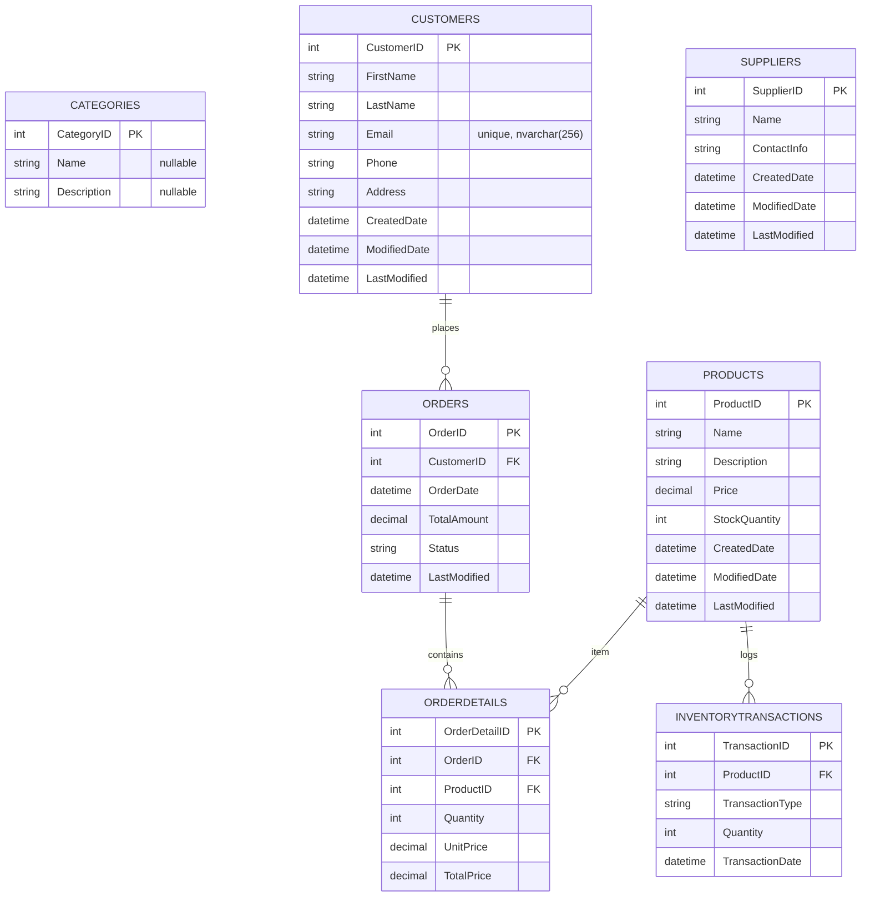

# Entity Relationship Diagram (ERD)

Tài liệu này mô tả schema hiện tại theo EF Core migration `InitialCreate` (20260317044512).

## Bảng (tables)

- `Categories`
- `Customers`
- `Suppliers`
- `Products`
- `Orders`
- `OrderDetails`
- `InventoryTransactions`

## ERD (Mermaid)

## Ghi chú quan trọng

FK được tạo trong DB (đã enforce bằng migration bổ sung):

- `Orders.CustomerID` → `Customers.CustomerID` (Restrict)
- `OrderDetails.OrderID` → `Orders.OrderID` (Cascade)
- `OrderDetails.ProductID` → `Products.ProductID` (Restrict)
- `InventoryTransactions.ProductID` → `Products.ProductID` (Restrict)

Ràng buộc unique:

- `Customers.Email` (unique index `IX_Customers_Email`)