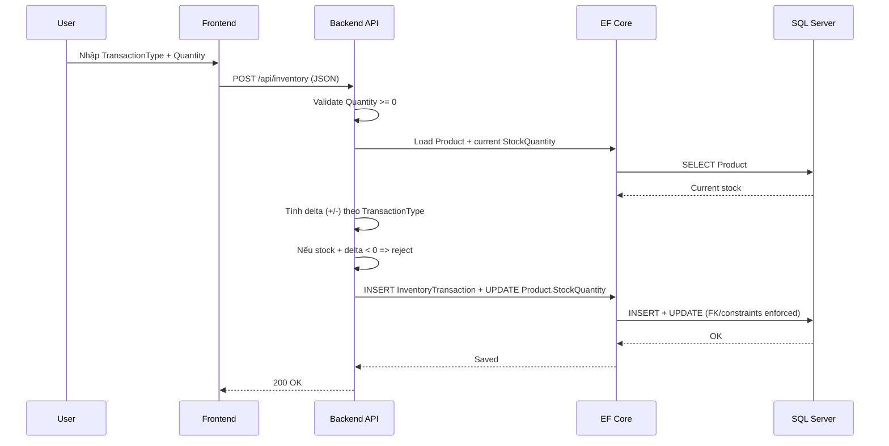
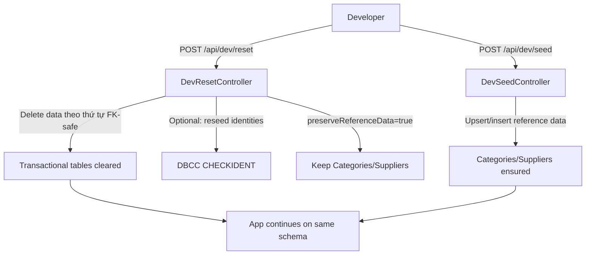

# Inventory Order Sync Management System

Hệ thống quản lý Products/Customers/Orders/Inventory/Suppliers.

Mục tiêu tài liệu: mô tả ngắn gọn, rõ cấu trúc, công nghệ, kết nối DB, và các artefact liên quan thiết kế/tối ưu/kiểm thử DB.

- Backend: ASP.NET Core Web API (.NET 7) + EF Core 7 + SQL Server
- Frontend (tuỳ chọn): Vite + React (proxy `/api` → backend)

Repo/workspace này tập trung vào backend, nhưng có thể chạy cùng frontend để demo luồng UI.

## Công nghệ sử dụng

- .NET 7 (`net7.0`)
- ASP.NET Core Web API
- Entity Framework Core 7 + SQL Server
- Swagger/OpenAPI (bật khi `ASPNETCORE_ENVIRONMENT=Development`)

## Database & Kết nối

- Database: SQL Server (LocalDB/Express/Developer/Full)
- Connection string: `appsettings.json` → `ConnectionStrings:DefaultConnection`
- Schema được tạo bởi EF Core Migrations trong `Migrations/`

Health-check để xác nhận backend đang connect vào DB nào:

- `GET /api/health/db` trả `dataSource` và `database`

## Cấu trúc thư mục (backend)

- `Controllers/`: Web API endpoints
- `Services/`: business logic (CRUD, inventory adjustments, reporting, sync)
- `Models/`: entities + DTO
- `Data/`: `AppDbContext`
- `Migrations/`: EF migrations
- `Database/`: tài liệu & script SQL
  - `ERD.md`: sơ đồ quan hệ dữ liệu. link: [ERD](https://github.com/boakang/Inventory_OrderSyncManagementSystem_backend/blob/main/Database/ERD.md)
  - `DataDictionary.md`: từ điển dữ liệu. link: [Data Dictionary](https://github.com/boakang/Inventory_OrderSyncManagementSystem_backend/blob/main/Database/DataDictionary.md)
  - `sample_data.sql`: seed data qua SSMS
  - `db_constraints.sql`: chuẩn hóa dữ liệu âm + CHECK constraints không âm
  - `db_functions.sql`: views/functions/stored procedures (tham khảo/chạy tay)

## Cấu trúc (frontend - tuỳ chọn)

Nếu bạn có workspace/frontend ở máy local (ví dụ: `D:\Inventory_OrderSyncManagementSystem_frontend`) thì đây là Vite + React.

- Proxy dev: `/api/*` → `http://127.0.0.1:5080`
- Một số UX đã được implement:
  - Orders list sort mới → cũ
  - Create Order: chọn Customer theo tên (dropdown)
  - Order Details page: `/orders/:id` và hỗ trợ tải PDF

## Chạy dự án

### Prerequisites

- .NET SDK 7.x
- SQL Server
- (Khuyến nghị) EF Core CLI: `dotnet-ef`

### 1) Apply migrations

```bash
dotnet tool install --global dotnet-ef
dotnet ef database update
```

### 2) Run

```bash
dotnet run
```

- HTTP: `http://localhost:5080`
- Swagger (Development): `http://localhost:5080/swagger`

## Chạy kèm frontend (tuỳ chọn)

Chạy backend trước:

```bash
dotnet run
```

Chạy frontend (ở thư mục frontend):

```bash
npm install
npm run dev
```

Frontend gọi API qua `/api/*`.

## Seed dữ liệu mẫu

### Cách A (Dev): endpoint seed

Chỉ hoạt động khi environment là Development.

```bash
curl -X POST http://localhost:5080/api/dev/seed
```

Lưu ý: seed hiện tập trung vào reference data (Categories/Suppliers) để tránh “data giả” nghiệp vụ.

### Cách B: chạy script trên SSMS

- `Database/sample_data.sql`
- (Khuyến nghị) chạy thêm `Database/db_constraints.sql` để chuẩn hóa dữ liệu và bật CHECK constraints.

## Kiểm tra kết nối DB (Health-check)

- `GET /api/health` → `{ status: "ok" }`
- `GET /api/health/db` → `canConnect`, `canQuery`, `dataSource`, `database`, `error`

## Data integrity (không âm)

Backend đã enforce các rule sau:

- `Products.Price >= 0`
- `Products.StockQuantity >= 0`
- `OrderDetails.Quantity >= 0`
- `InventoryTransactions.Quantity >= 0`
- Khi thao tác tồn kho theo transaction outbound (Stock Out / Issue / Sales Order), hệ thống sẽ trừ stock và không cho stock xuống dưới 0.

Lưu ý: lịch sử tồn kho (`InventoryTransactions`) hiện lưu `Quantity` không âm; hướng tăng/giảm được suy ra từ `TransactionType`.

## Inventory (source of truth)

Tồn kho “hiện tại” được lấy từ `Products.StockQuantity` (source of truth). API inventory trả thêm view-friendly fields (product/category/supplier) để frontend không phải join nhiều request.

## Sơ đồ hoạt động

### 1) Tổng quan luồng dữ liệu (Frontend ↔ Backend ↔ SQL Server)

```mermaid
flowchart LR
  U[User/Browser] -->|UI actions| FE[Frontend: Vite + React :3000]
  FE -->|HTTP JSON: /api/*| VP[Vite Proxy]
  VP -->|Forward| BE[Backend: ASP.NET Core Web API :5080]

  BE -->|EF Core DbContext| EF[EF Core 7]
  EF -->|SQL queries/transactions| DB[(SQL Server: InventoryOrderDB)]

  DB -->|Tables + Constraints + Indexes| DB
  DB -->|Views/Functions/SP (optional)| DB

  BE -->|DTO JSON response| FE
```

### 2) Luồng Adjust Inventory (không cho stock âm)



### 3) Dev utilities: Reset data (giữ schema) + Seed reference data



## API Endpoints

Base path: `/api/*`

CRUD:

- `GET/POST/PUT/DELETE /api/products`
- `GET/POST/PUT/DELETE /api/customers`
- `GET/POST/PUT/DELETE /api/orders`
- `GET/POST/PUT/DELETE /api/inventory`
- `GET/POST/PUT/DELETE /api/categories`
- `GET/POST/PUT/DELETE /api/suppliers`

Dev utilities (chỉ chạy khi `ASPNETCORE_ENVIRONMENT=Development`):

- `POST /api/dev/reset?reseedIdentities=true&preserveReferenceData=true`
  - Reset data nghiệp vụ, giữ schema
  - Mặc định giữ Categories/Suppliers
- `POST /api/dev/seed`
  - Seed reference data
- `POST /api/dev/maintenance/recalc-orderdetail-totalprice?dryRun=true|false`
  - One-time fix: backfill `OrderDetails.TotalPrice` cho dữ liệu cũ

Reports:

- `GET /api/reports/top-selling?topN=5`
- `GET /api/reports/revenue?period=daily|monthly`
- `GET /api/reports/inventory`

Synchronization (delta sync theo `LastModified`):

- `GET /api/Synchronization/GetUpdatedData?lastModified=...`
- `POST /api/Synchronization/UploadChanges`

## Ghi chú liên quan 

- Thiết kế & quản lý DB: tài liệu `Database/ERD.md`, `Database/DataDictionary.md`, các script tạo bảng/constraint
- Hỗ trợ Backend: EF Core (`Data/AppDbContext.cs`, migrations), Web API (Controllers/Services)
- Kiểm thử & bảo trì: `GET /api/health/db` để kiểm tra canConnect/canQuery; script CHECK constraints để đảm bảo toàn vẹn

## Notes về OrderDetails.TotalPrice

- Dữ liệu cũ có thể có `OrderDetails.TotalPrice = 0` (do trước đây chưa set field khi tạo order).
- Backend đã set `TotalPrice = Quantity * UnitPrice` cho order mới.
- Có endpoint dev maintenance để backfill dữ liệu cũ.

## Dev settings

- CORS: policy `AllowAll` đã bật trong `Program.cs` để hỗ trợ frontend trong quá trình dev.

## Các link khác trong project
[Frontend](https://github.com/boakang/Inventory_OrderSyncManagementSystem_frontend)
[Database](https://github.com/boakang/Inventory_OrderSyncManagementSystem_sqlserver)
